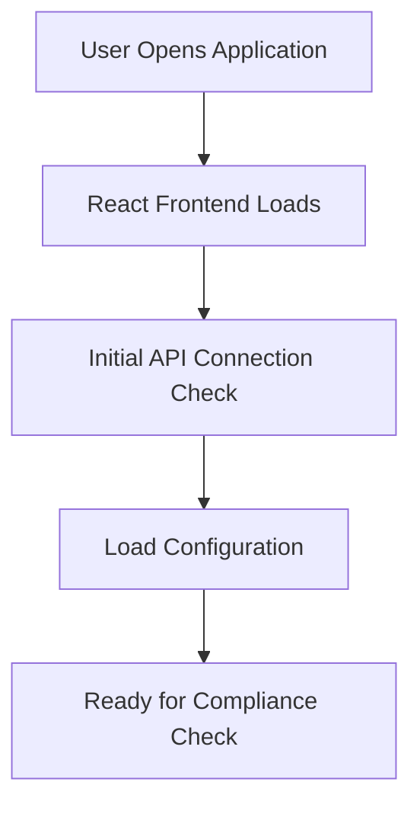
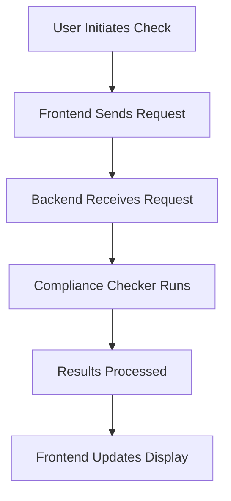

# Windows Compliance Checker - Technical Documentation

## Table of Contents

1. [Project Overview](#project-overview)
2. [Architecture](#architecture)
3. [Backend (FastAPI)](#backend-fastapi)
4. [Frontend (React)](#frontend-react)
5. [Project Flow](#project-flow)
6. [Detailed Component Breakdown](#detailed-component-breakdown)
7. [Troubleshooting Guide](#troubleshooting-guide)

## 1. Project Overview

### What is Windows Compliance Checker?

The Windows Compliance Checker is a modern web application that helps system administrators and IT professionals verify if their Windows systems comply with security standards and best practices. The application consists of a FastAPI backend for system checks and a React frontend for user interaction.

### Key Features

- System compliance scanning
- Real-time compliance status reporting
- Detailed security recommendations
- User-friendly interface
- Cross-platform web access

## 2. Architecture

### High-Level Architecture

```
Windows Compliance Checker
├── Backend (FastAPI)
│   └── Handles system checks and business logic
└── Frontend (React)
    └── Provides user interface and data visualization
```

### Why This Architecture?

- **FastAPI Backend**:

  - Fast performance (built on Starlette and Pydantic)
  - Automatic API documentation
  - Native async support
  - Type checking and validation
  - Easy Windows system interaction using Python

- **React Frontend**:
  - Component-based architecture
  - Virtual DOM for efficient updates
  - Rich ecosystem of libraries
  - TypeScript support for better code quality
  - Responsive and interactive UI

## 3. Backend (FastAPI)

### Directory Structure

```
backend/
├── app/
│   ├── main.py              # Application entry point
│   ├── core/
│   │   ├── compliance_checker.py    # Core checking logic
│   │   └── rule_extractor.py       # Rule processing
│   ├── models/
│   │   └── compliance_models.py     # Data models
│   ├── api/
│   │   └── endpoints/
│   │       ├── compliance.py        # API routes
│   │       └── rules.py            # Rules management
│   └── utils/
│       └── windows_utils.py        # Windows-specific utilities
└── requirements.txt
```

### Key Components

#### 1. Main Application (main.py)

```python
from fastapi import FastAPI
from fastapi.middleware.cors import CORSMiddleware

# Initializes the FastAPI application
# Handles CORS for frontend communication
# Sets up routing and middleware
```

#### 2. Compliance Checker (compliance_checker.py)

- Purpose: Core logic for system compliance checking
- Functions:
  - `check_system_compliance()`: Main compliance checking function
  - `analyze_security_settings()`: Security analysis
  - `generate_compliance_report()`: Report generation

#### 3. Rule Extractor (rule_extractor.py)

- Purpose: Manages compliance rules and their processing
- Key Features:
  - Rule parsing
  - Rule validation
  - Rule application

#### 4. Models (compliance_models.py)

- Defines data structures using Pydantic
- Ensures type safety and validation
- Examples:
  ```python
  class ComplianceCheck(BaseModel):
      rule_id: str
      description: str
      status: bool
      details: str
  ```

## 4. Frontend (React)

### Directory Structure

```
frontend/
├── src/
│   ├── components/          # Reusable UI components
│   ├── pages/              # Page components
│   ├── services/           # API services
│   └── types/              # TypeScript definitions
└── package.json
```

### Key Components

#### 1. Pages

- **Home.tsx**: Main dashboard
- **Results.tsx**: Compliance results display

#### 2. Components

- **ComplianceChecker.tsx**: Main checking interface
- **RuleViewer.tsx**: Rule display and management
- **Layout.tsx**: Common layout components

#### 3. Services

- **api.ts**: API integration with backend

## 5. Project Flow

### 1. Initialization Flow



### 2. Compliance Check Flow



### 3. Data Flow

1. User interaction triggers compliance check
2. Frontend sends request to FastAPI backend
3. Backend performs system checks
4. Results are processed and formatted
5. Frontend receives and displays results

## 6. Detailed Component Breakdown

### Backend Components

#### FastAPI Routes

```python
@app.get("/api/compliance/check")
async def check_compliance():
    # Performs compliance check
    # Returns results in structured format
```

#### Compliance Checking Logic

1. System Information Gathering
2. Rule Application
3. Result Compilation
4. Report Generation

### Frontend Components

#### React Components Hierarchy

```
App
├── Layout
│   ├── Navigation
│   └── Footer
├── Home
│   └── ComplianceChecker
└── Results
    ├── SummaryView
    └── DetailedView
```

## 7. Troubleshooting Guide

### Common Issues and Solutions

#### Backend Issues

1. Connection Errors

   - Check FastAPI server status
   - Verify CORS settings
   - Check port availability

2. System Access Issues
   - Verify Windows permissions
   - Check administrative access
   - Review security policies

#### Frontend Issues

1. API Connection

   - Verify API endpoint configuration
   - Check network connectivity
   - Review console for errors

2. Display Issues
   - Clear browser cache
   - Check React component lifecycle
   - Verify data structure matching

### Best Practices

1. Regular testing
2. Error logging
3. Input validation
4. Security considerations
5. Performance monitoring

## Conclusion

This documentation provides a comprehensive overview of the Windows Compliance Checker project. As a fresher, focus on understanding:

1. The overall architecture and why it was chosen
2. How different components interact
3. The flow of data through the system
4. How to troubleshoot common issues

Remember to:

- Start with understanding the basic flow
- Practice with small changes first
- Use the debugging tools provided
- Refer to this documentation when stuck

## Additional Resources

- FastAPI Documentation: https://fastapi.tiangolo.com/
- React Documentation: https://reactjs.org/
- TypeScript Handbook: https://www.typescriptlang.org/docs/
- Windows System Programming: https://docs.microsoft.com/en-us/windows/win32/
